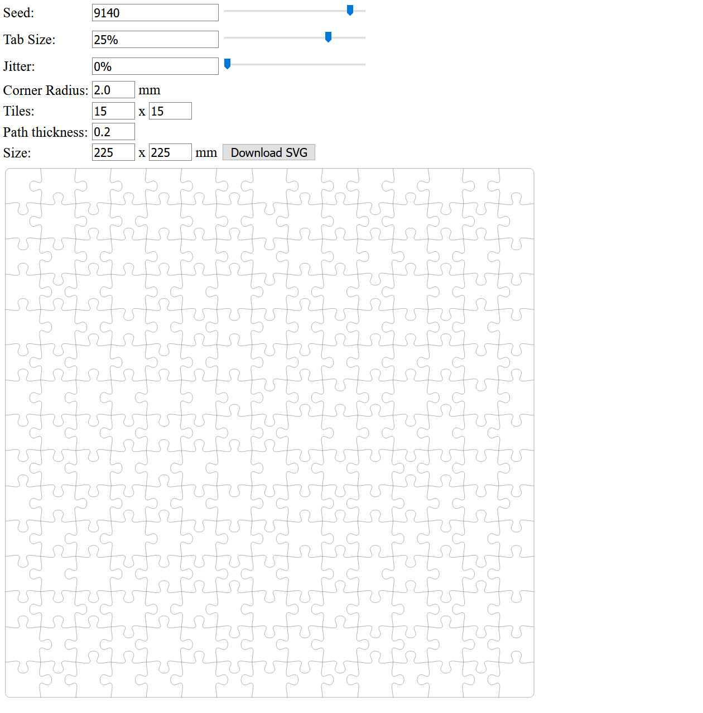

# 3D-jigsaw-puzzle
A procedure and the necessary files to generate 3D jigsaw puzzles.

## Step 0: Introduction

This repo contains all necessary files and steps to create your own 3D-jigsaw-puzzles.
If you want to first try out a small puzzle before making your own, load the "example_small/puzzle_finished.stl".
You should get something similar to this: 

 
 
This guide assumes you are somewhat familiar with 3D modelling, CAD and boolean operations.
I try my best to provide a step by step guide.
But I will not explain **every** button and click which will be necessary. 
What will we be doing?
We will first generate a 2D-puzzle-path as SVG.
Afterwards we will extrude this path to get a 3D-puzzle.
The last step is to cut the 3D-puzzle to a specific shape.  
To create your own puzzle you will either need a [Heightmap](https://en.wikipedia.org/wiki/Heightmap) of your desired shape or a 3D model (or combination of both).

This was an entry to the 2020 puzzle challenge.
See it on instructables [here]().

## Step 1: Tools and Software

* Tools:
    * 3D-printer

* Software:
  * [OpenScad](https://www.openscad.org/)
  * [Blender](https://www.blender.org/)
  * Contents of this repo
  * optional: image manipulation software

## Step 2: Create a puzzle path
First we need to create a puzzle path.
For this open the "jigsaw.html".
You should see a screen similar to this:  
  
In the generator you should set the amount of tiles you want.
If you change the amount of tiles be sure to adjust the size of the puzzle.
For me a value of 15 per piece worked well.
Therefore I always set $size = tiles \times 15$. 
But most important is the Path thickness.
All the other values can be changed later with extrusion and/or scaling in blender.
But the Path thickness sets the Gap between the individual puzzle pieces.
Here you should know which clearances your printer can produce.
If you are not sure print the files in "/clearance_test/clearance_xxx.stl" as a test and adjust the path thickness.
If the gap between the puzzle tiles is too small it will not stay together. But if the gaps are to big the puzzle can not be put together. 
If you have settle down all your settings export a .svg of your puzzle with the "Download SVG" button.  

## Step 3: Make a 3D-object from your path
Open the "puzzle.scad" in OpenSCAD.
If you cloned the repository you should be greeted with a screen similar to this: 
 
Now change the "puzzle_path" to the path of your .svg-file.
You can set a value for the height too.
However this is not too important because you can scale the object in Blender too. 
Now press *F6* or *Design -> Render*.
After this save the model as .stl (press *F7* or *"File" -> "Export" -> "Export as STL"*). 

## Step 4: Use the 3D-puzzle to make the desired puzzle shape
Now open Blender.
First delete the default cube, camera and light.
Now load your puzzle's *.stl ("File" -> "import" -> "Stl").

 
 

### Option 1: Use a Heightmap
If you want to use a Heightmap add a plane and scale it to be slightly larger than the 3D-puzzle. 

You should also switch into edit-mode (tab-key) and add an "Edge Crease" (crtl + e) to all four sides of the plane with maximum strength (indicated by lila/pink edges). 

 
 

Now add two modifiers **to the plane**.
First a "Multiresolution"-modifier and second a "Displace"-modifier.
The "Multiresolution"-modifier's subdivision should be set to s level where you are satisfied with the resolution.
Add a New Texture to the "Displace"-modifier. 

 

Now switch to the Texture-tab and load your heightmap.
For this the Type must be set to "Image or Movie" 

 

Optionally you can use one of the Heightmaps which blender is able to generate.
I am using here a "Wood"-type one.
You can play with those settings until you find something you like. 

#### Tips if the plane does not look like desired:
* If the generated plane does look too "low poly" you need to further subdivide your plane.
* You can change the strength the Heightmap influences the plane in the Settings of the "Displace"-modifier.
* If the plane is too low you can change this too in the options of the "Displace"-modifier.
* If the Generated puzzle is not tall enough you can resize it with (s -> z -> mouse movement) 

After this your plane should be completely inside the puzzle: 
 
 

Now add a "Boolean"-modifier to the 3D-puzzle.
Set it to "difference" and the "Object" to your plane.
Finally apply the modifier. 
 

Now switch to edit mode and select all vertices on the top of the Puzzle. 

 

And delete all of them.
you should be left with a 3D-printable shape like this: 

 

### Option 2: Use a 3D-Object
First you need to make sure that the object is non-overlapping and in general 3D-printable.
However consider that you will cut the object and this **could** make it 3D-printable.
Now import the model like you did with the 3D-puzzle.
Next scale, rotate and place it in the scene the way you want it to be.
The part which should be in the puzzle should be **inside** the 3D-puzzle. 

 

Now add a "Boolean"-modifier to the puzzle and set it to "Intersect".
Apply it and like option 2 remove the vertices from the top to reveal your finished 3D-puzzle.

### Option 3: Use option 1 and 2
You also can combine the approaches as I have done in this example with the heart and the sine-Heightmap.
The procedure is nearly the same as you would just do option 1 and afterwards option 2. 
The only difference is that you have to join the plane and the 3D-object with **crtl + j** before you apply a boolean set to "Difference" to the 3D-puzzle.  
 

## Step 5: Print it!
Fire up your favorite slicer and make sure everything looks good in the preview.
Now send it to your printer and watch your puzzle grow!

## Step 6: You have done it!
You have created your custom 3D-jigsaw-puzzle.
Give it as a present to a special person or keep it and just enjoy!

## Want more?
You can try out to generate your puzzle using [this software](https://github.com/bonniee/svg-puzzle-gen). It allows complexer puzzle pieces. If you want to make some true maniac puzzles, give it a shot! 
you can also use any puzzle *.svg. Therefore Go and find the most interesting puzzle you can imagine!

## References
The original jigsaw generator can be found [here](https://community.glowforge.com/t/jigsaw-puzzle-generator/9284)  
The original design of the heart can be found [here](https://sketchfab.com/3d-models/love-low-poly-dd3b881a34904991878dc6a5a05aa1f6). It was designed by [Vladislav Fehu](https://sketchfab.com/VladislavFehu)